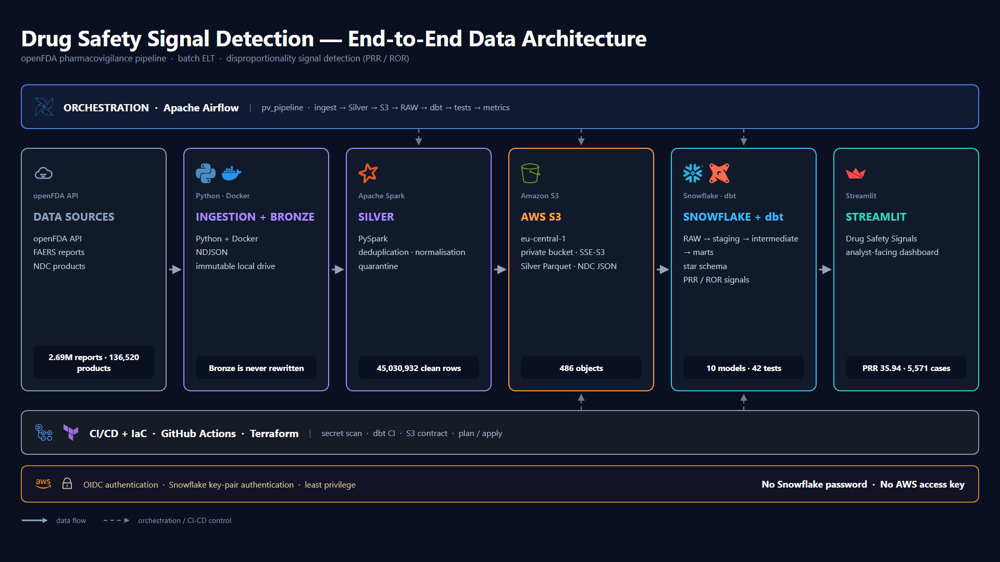

# Drug Safety Signal Detection

**An end-to-end pharmacovigilance data pipeline over openFDA FAERS data.**
It turns two years of public adverse-event reports into a ranked list of drug–reaction
pairs that are reported far more often than chance would explain — for a drug-safety
analyst to triage.

> Data Engineering Capstone · Spiced Academy / neue fische · August 2026
> Nastaran Kouhdareh

---

## The problem

When a medicine causes a side effect that clinical trials were too small to catch, the
first evidence usually appears in spontaneous reports: a doctor, pharmacist or patient
files a report with the regulator. The US FDA publishes these as FAERS, and openFDA
makes them free to download.

The reports are close to unusable as they arrive. One report contains many drugs and
many reactions nested inside each other, so nothing can be counted without flattening
it first. The same drug is written a dozen ways across reports — brand name, generic
name, misspellings, dosage text — so a drug's cases fragment across name variants. And
even once it is clean, the volume defeats manual review: this dataset yields
**1,240,645 distinct drug–reaction pairs**. Nobody reads that list.

A drug-safety analyst needs the opposite of a data dump. They need a short, ranked list
of candidates worth a human look, with the evidence behind each one visible so they can
judge it.

## What this does

Python downloads FAERS reports, drug labels and the NDC product directory into an
immutable local Bronze layer. PySpark flattens the nested JSON to a defined atomic
grain, deduplicates it, and quarantines what fails validation. The clean Parquet lands
in a private S3 bucket, loads into Snowflake through an external stage, and dbt builds
a star schema plus PRR/ROR disproportionality metrics. Airflow runs all eight steps
from one trigger. A Streamlit dashboard hosted inside Snowflake serves the ranked
candidates.

---

## Results

| Metric | Value |
|---|---|
| Source reports ingested (FAERS, 2023–2024) | **2,687,675** |
| Flattened atomic rows | 93,366,638 |
| Clean Silver rows after deduplication | **45,030,932** (51.8 % removed) |
| Rows quarantined, not dropped | 431,760 |
| Null reactions remaining in Silver | **0** |
| dbt models | **10** |
| dbt tests passing | **42** (`dbt build` → PASS=53, WARN=0, ERROR=0) |
| Python unit tests | 21 |
| Drug–reaction pairs scored | 1,240,645 |
| Candidate signals flagged | 315,270 (25.4 % of pairs) |
| Full 24-month pipeline run, one trigger | **3 h 57 m 23 s**, 8/8 tasks green |
| Money actually paid | **$0.25** (AWS S3) + $42 of a $400 Snowflake trial credit |

**The acceptance signal.** The pipeline recovers a drug-safety finding that has been
known to medicine for decades — clozapine causing neutropenia, a drop in the white
blood cells that fight infection:

> **clozapine → neutropenia** — **PRR 35.94** · ROR 46.76 · ROR-CI lower 45.21 ·
> χ² 142,896 · **5,571 cases**, present in all 24 months.

Neutropenia is reported roughly **36 times more often** for clozapine than for drugs in
general. A method that misses this is broken, so it is used as the end-to-end
correctness check: the same figure is reproduced by the warehouse, by the local
dashboard and by the hosted one, and it did not move when the loading path was cut over
from Snowflake internal stages to S3.

---

## Architecture



Six stages left to right carry the data. Airflow sits above them and CI/CD below —
both joined by dashed arrows, because they *control* the pipeline rather than carrying
data through it. Only two of the six stages are in the cloud: the 64 GB Bronze layer
never leaves the laptop, and about 8 GB of Silver Parquet is all that is uploaded.
Airflow never processes the 45 million rows itself; it triggers Spark and dbt in their
own containers and records the result.

Full walkthrough, including what was rejected at each layer: [`architecture.md`](architecture.md).

### Tech stack

| Layer | Tool | Why this one |
|---|---|---|
| Ingestion | **Python 3.11 + `requests`** | Three REST endpoints and one auth scheme. An ingestion framework would add a dependency without removing work. |
| Raw storage (Bronze) | **Local disk, NDJSON** | 64 GB of immutable raw JSON. Keeping it local is why the cloud bill is 25 cents; only Silver is worth uploading. ([ADR-009](docs/adr/ADR-009-hybrid-deployment-bronze-local.md)) |
| Cleaning (Silver) | **PySpark in Docker** | The work is exploding nested arrays with severe fan-out — one report holds up to 4,113 drugs. That is what Spark is for. ([ADR-004](docs/adr/ADR-004-dbt-and-spark-transformation.md)) |
| Object storage | **AWS S3** (`eu-central-1`, private, SSE-S3) | Makes Silver an independent artifact you can inspect and baseline, rather than a file pushed inside a database. ([ADR-011](docs/adr/ADR-011-s3-external-stages.md)) |
| Warehouse | **Snowflake** | Separates storage from compute, reads Parquet from S3 through an external stage with no stored keys, and answers 45M-row aggregations in seconds. ([ADR-002](docs/adr/ADR-002-warehouse-snowflake.md)) |
| Transformation | **dbt Core** | The modelling work is SQL-shaped, and dbt brings tests, lineage and docs with it. ([ADR-004](docs/adr/ADR-004-dbt-and-spark-transformation.md)) |
| Orchestration | **Apache Airflow 2.10.5** in Docker | One trigger runs eight tasks in dependency order and fails loudly. Pinned to 2.10.5 deliberately — `stable` now serves 3.x. ([ADR-010](docs/adr/ADR-010-airflow-triggers-containers.md)) |
| Serving | **Streamlit hosted in Snowflake** | The demo is a URL. No laptop, no Docker, no terminal in the demo path. |
| CI/CD | **GitHub Actions** (4 workflows, 8 checks) | Converts documented claims into tests that run on every change. ([ADR-013](docs/adr/ADR-013-separate-ci-identity.md)) |
| Infrastructure as code | **Terraform**, scoped to one IAM role | Deliberately narrow: two objects, imported rather than created. ([ADR-014](docs/adr/ADR-014-terraform-ci-role-only.md)) |

---

## Setup

> **Honest expectation.** This is a hybrid project: three Docker stacks, three Python
> virtual environments, an AWS account and a Snowflake account. It is not a
> single-command clone-and-run, and pretending otherwise would waste your time. A
> first-time setup is roughly **60–90 minutes**, most of it waiting for the initial
> data download. Once set up, starting it is two commands.

### Prerequisites

| Requirement | Notes |
|---|---|
| Python 3.11 | |
| Docker Desktop | With a WSL2 memory reservation of at least 10 GB — see step 5 |
| Disk space | **~70 GB free** on the data drive (64 GB Bronze + Silver Parquet + Spark spill) |
| openFDA API key | Free from <https://open.fda.gov/apis/authentication/> |
| AWS account | An S3 bucket in the same region as your Snowflake account |
| Snowflake account | A trial is sufficient |

### 1 · Clone and configure

```bash
git clone https://github.com/nkouhdareh/de-capstone-pipeline.git
cd de-capstone-pipeline
cp .env.example .env
```

Fill in `.env`. It is git-ignored and must never be committed.

| Variable | Purpose |
|---|---|
| `DATA_DIR` | Where Bronze and Silver live, e.g. `D:/capstone/data`. **Never inside the repo.** |
| `OPENFDA_API_KEY` | Raises the API limit to 120,000 requests/day |
| `SNOWFLAKE_ACCOUNT`, `SNOWFLAKE_USER` | The service identity, not your human login |
| `SNOWFLAKE_PRIVATE_KEY_PATH` | Path to the RSA private key, **outside the repo** |
| `AWS_ACCESS_KEY_ID`, `AWS_SECRET_ACCESS_KEY`, `AWS_REGION`, `S3_BUCKET` | Used only by the `upload_s3` task |

### 2 · Snowflake key-pair authentication

Snowflake deprecated password-only sign-in on 18 August 2026, so this project uses key
pairs only. Generate the pair **outside the repository**:

```bash
openssl genrsa 2048 | openssl pkcs8 -topk8 -inform PEM -out rsa_key.p8 -nocrypt
```

```bash
openssl rsa -in rsa_key.p8 -pubout -out rsa_key.pub
```

Register the public half against a `TYPE = SERVICE` user in a Snowflake worksheet:

```sql
ALTER USER DE_CAPSTONE_SVC SET RSA_PUBLIC_KEY='<contents of rsa_key.pub, one line, no BEGIN/END headers>';
```

There is no Snowflake password anywhere in this project. See
[ADR-012](docs/adr/ADR-012-snowflake-key-pair-service-identity.md).

### 3 · Create the Snowflake RAW objects

Run `scripts/ddl_raw.sql` once in a Snowflake worksheet. It creates
`RAW.SILVER_DRUG_EVENT`, `RAW.DRUG_NDC`, the stages and the file formats.

### 4 · Ingest Bronze

```bash
python -m venv .venv
```

```bash
source .venv/Scripts/activate && pip install requests python-dotenv
```

```bash
python scripts/ingest_drug_ndc.py && python scripts/ingest_drug_label.py && python scripts/ingest_drug_event.py
```

The FAERS download goes day by day and takes **30–60 minutes**. Bronze is immutable —
once it exists, the pipeline skips this step.

Expect: **2,687,675** event reports · **261,258** labels · **136,520** NDC products.

### 5 · Give Docker enough memory

Create or edit `%UserProfile%\.wslconfig`:

```
[wsl2]
memory=10GB
```

Then `wsl --shutdown` and restart Docker Desktop. Without this, Spark fails with a
*native* memory error that looks nothing like an out-of-memory error — see the failure
playbook in [`runbook.md`](runbook.md).

### 6 · Start the three stacks

```bash
docker compose up -d
```

```bash
cd airflow && docker compose up -d
```

Wait 1–2 minutes, then confirm **8 containers** are up:

```bash
docker ps --format "table {{.Names}}\t{{.Status}}"
```

Airflow UI: <http://localhost:8080> — login `airflow` / `airflow`.

### 7 · Run the pipeline

```bash
cd airflow && docker compose exec airflow-scheduler airflow dags trigger pv_pipeline -c '{"months":"2023-01"}'
```

One month exercises the entire chain in about 20 minutes and still ends with all
45,030,932 rows loaded. Use `{"months":"all"}` for a full rebuild (~4 hours).

**Expected gates:** `dbt_build` → `PASS=53` · `dbt_test` → `PASS=42` · `load_raw` →
`45030932` · `upload_s3` → 486 objects.

### 8 · Open the dashboard

Hosted (no local setup): Snowsight → **Projects → Streamlit → Drug Safety Signals**.

Or locally:

```bash
python -m venv .venv-app && .venv-app/Scripts/python.exe -m pip install streamlit snowflake-connector-python python-dotenv
```

```bash
.venv-app/Scripts/streamlit.exe run app/dashboard.py --server.port 8501
```

**Stop everything** with `docker compose stop` in both directories. Never
`docker compose down -v` on the Airflow stack — it deletes Airflow's metadata database.

---

## What this is not

**This is a screening tool, not proof of causality.** Disproportionality analysis
measures *what gets reported*, not what a drug does. There is no denominator of treated
patients anywhere in this data, so a high ratio says only that a pairing is written down
together unusually often — which has many causes besides pharmacology.

Ranking the results by raw PRR puts artifacts at the top, and this is worth stating
plainly because it is a finding, not a defect:

| Pattern | Example | Why it appears |
|---|---|---|
| Confounding by indication | nitrates → cardiospasm | The drug treats the condition it is reported with |
| Device / product-use events | copper → foreign body in reproductive tract | Implants and devices generate product reports inside a drug dataset |
| Reporting bias | talc → mesothelioma | Litigation-driven reporting inflates the ratio |
| **A genuine finding** | pentosan polysulfate → pigmentary maculopathy | A real signal that led to an FDA label change |

A stricter statistical threshold does not fix this: the strict flag prunes only **269 of
315,270** pairs. Equally, the method does not simply rank by volume — `CLOZAPINE → Death`
has **1,848 cases** but a PRR of **1.92** and is **not** flagged.

The correct output is therefore a ranked candidate list with the supporting counts
shown, for an expert to triage. Nothing here is a clinical or regulatory conclusion.

**Also deliberately not built:** no streaming layer (FAERS has no real-time feed —
[ADR-007](docs/adr/ADR-007-no-streaming-layer.md)), no fuzzy drug-name matching
([ADR-005](docs/adr/ADR-005-drug-name-resolution-tiers.md)), and no retrieval/RAG layer
over label text — planned as an extension and dropped under its own hard stop
([ADR-015](docs/adr/ADR-015-retrieval-extension-not-built.md)).

---

## Data source and licence

| Source | Endpoint | Records used | Licence |
|---|---|---|---|
| openFDA FAERS adverse-event reports | `/drug/event.json` | 2,687,675 (2023–2024) | US Government public domain |
| openFDA drug labels | `/drug/label.json` | 261,258 | US Government public domain |
| openFDA NDC directory | `/drug/ndc.json` | 136,520 | US Government public domain |

FAERS is de-identified public data. No personally identifiable information is handled;
patient age is banded rather than stored exactly, as a defensive measure.

**Limitations users must know about.** FAERS is a spontaneous reporting system, which
means under-reporting, duplicate submissions, stimulated reporting after publicity or
litigation, missing demographics, and indication effects. MedDRA reaction terms are
used only as published by the FDA; the MedDRA dictionary itself is licensed and is
never redistributed here.

---

## Documentation

| Document | Contents |
|---|---|
| [`architecture.md`](architecture.md) | The diagram explained stage by stage, tool choices and what was rejected |
| [`runbook.md`](runbook.md) | Start it, run it, verify it, recover it — and the failure playbook |
| [`docs/adr/`](docs/adr/) | Architecture Decision Records — why, and what was rejected |
| [`docs/business_requirements.md`](docs/business_requirements.md) | Business case, requirements, glossary |
| [`docs/technical_requirements.md`](docs/technical_requirements.md) | TR-xx technical specification |
| [`docs/Metadata/`](docs/Metadata/) | Field dictionary, source schemas, metadata catalogue |
| [`docs/PROGRESS.md`](docs/PROGRESS.md) | Build log — what was done, when, and what it produced |
