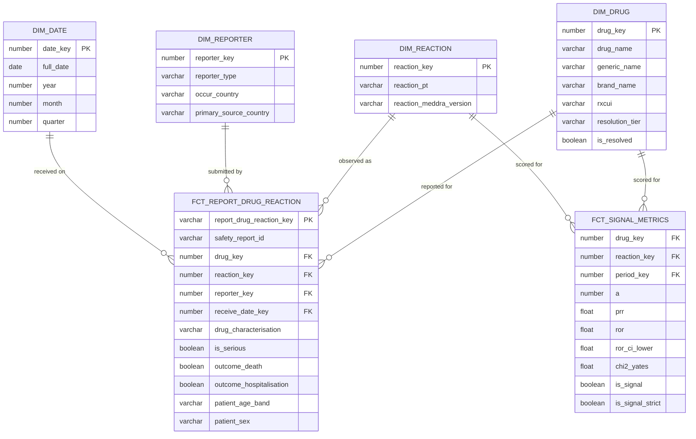

# Architecture

## Drug Safety Signal Detection — openFDA pharmacovigilance pipeline

| | |
|---|---|
| **Author** | Nastaran Kouhdareh |
| **Version** | 1.0 — as built |
| **Date** | 19 August 2026 |
| **Status** | Implemented and verified end to end |
| **Depends on** | [`docs/business_requirements.md`](docs/business_requirements.md), [`docs/technical_requirements.md`](docs/technical_requirements.md) |

This document describes the system **as built**, not as originally planned. Where the
build diverges from the technical requirements, the divergence is stated and pointed at
the ADR that records the decision.

---

## 1. The diagram


**How to read it.** The six boxes across the middle are the data flow, left to right,
joined by **solid arrows**. The band above is **Airflow**; the band below is **GitHub
Actions and Terraform**. Both are joined to the pipeline by **dashed arrows**, because
they *control* it rather than carrying data through it. The colours mark where each
stage runs: purple is local Docker, orange is AWS, blue is Snowflake, teal is the
dashboard, grey is CI/CD.

Three things are worth saying out loud before any detail:

1. **Only two of the six stages are in the cloud.** Bronze and Silver are computed
   locally. That is why the whole build cost $0.25 of real money.
2. **Airflow does not sit inside the flow.** It triggers Spark and dbt in their own
   containers and never touches the 45 million rows itself.
3. **CI/CD touches the pipeline at exactly two points** — the S3 artifact and the
   Snowflake schema — and it can only *read* the first of them.

---

## 2. Pattern and layering

**Pattern: batch ELT into an OLAP warehouse, organised as a medallion.**

FAERS has no real-time feed. It is a spontaneous-reporting system published in batches,
so a Lambda or Kappa architecture would be answering a question the data does not ask.
A synthetic stream would have added moving parts and risk without adding information
([ADR-007](docs/adr/ADR-007-no-streaming-layer.md)).

Layering is **Bronze → Silver → Gold (marts) → Semantic**, chosen over Data Vault
because there is one source system and no need to absorb conflicting definitions from
multiple business units — Data Vault's hubs, links and satellites would have added a
join layer for no gain at this scale ([ADR-003](docs/adr/ADR-003-medallion-layering.md)).

```
Bronze     immutable raw JSON, exactly as the API returned it
  ↓
Silver     flattened, cast, decoded, deduplicated, validated — one atomic grain
  ↓
Marts      star schema: 4 conformed dimensions + 2 fact tables
  ↓
Semantic   PRR / ROR / chi-square — the only place the formulas exist
```

---

## 3. The flow, stage by stage

### 3.1 Sources — openFDA

| Endpoint | Purpose | Records used |
|---|---|---|
| `/drug/event.json` | FAERS adverse-event reports, 2023–2024 | **2,687,675** |
| `/drug/label.json` | Product label text | 261,258 |
| `/drug/ndc.json` | Product directory, for drug identity | 136,520 |

**Why openFDA:** public, keyless, US-Government public domain, and deeply nested and
messy enough to be worth engineering. It also aligns with a medical background, so the
output can be judged for correctness rather than merely for shape
([ADR-001](docs/adr/ADR-001-domain-and-data-source.md)).

**Rejected:** MIMIC-IV (credentialing gate), German SMARD/ENTSO-E electricity (cleaner
data, no text, already built by a previous cohort), OpenSky/GDELT (access uncertainty,
scope risk).

**The constraint that shaped ingestion.** openFDA caps the `skip` offset, so no single
query can be paged past roughly 26,000 records. Rather than fight it, every query is
partitioned by `receivedate` — one day at a time, 1,000 records per request. That turns
the constraint into three properties for free: the extraction is **idempotent**
(re-running a day yields the same rows), **resumable** (delete the last partial day and
restart from it), and **backfillable** (the same code with different dates).

Label and NDC are too large to page at all, so they come from the openFDA bulk download
index instead. Two ingestion paths, one shared NDJSON writer.

### 3.2 Bronze — immutable raw, on local disk

**Where it physically lives:** `D:/capstone/data/bronze/`, partitioned as
`drug_event/receivedate=YYYYMMDD/part-N.json`. **64 GB. Never uploaded, never modified,
never deleted by the pipeline.**

**Why local rather than S3.** The technical requirements originally placed Bronze in S3
(TR-05/06/07). It stays local because 64 GB of raw JSON that only Spark ever reads has
nothing to gain from object storage, and everything to lose in upload time and cost.
Only the ~8 GB of Silver Parquet that Snowflake actually needs is uploaded. This is the
single largest deviation from the original design and it is deliberate
([ADR-009](docs/adr/ADR-009-hybrid-deployment-bronze-local.md)).

**Why immutable.** Transformation logic is wrong at least once. Because Bronze is never
rewritten, Silver and the warehouse can be rebuilt from scratch without touching the API
again. The Airflow ingest tasks are guarded — they check whether Bronze exists and skip
in one second rather than re-downloading for an hour.

**Cost: $0.** It never leaves the machine.

### 3.3 Silver — PySpark

**Where it physically lives:** `D:/capstone/data/silver/`, Parquet partitioned by
`receive_year` / `receive_month`. Roughly 3.9 GB across 486 files.

**The grain, declared:**

> one row = one safety case × one resolved drug × one drug characterisation × one reaction

Everything downstream depends on this sentence being true, so it is enforced by a
SHA-256 grain key that is tested for uniqueness.

Five operations, in order:

1. **Keep the latest report version.** FAERS resubmits amended cases; only the highest
   `safetyreportversion` per `safetyreportid` survives. Counting every version would
   inflate case counts and manufacture signals.
2. **Flatten.** `posexplode` the drug array, then explode reactions within it. A report
   with 10 drugs and 20 reactions becomes 200 rows. This is why 2.7 million reports
   become **93,366,638** atomic rows.
3. **Validate and quarantine.** Rows with a null or out-of-range `drugcharacterization`,
   a blank drug name, or a blank reaction term are written to a quarantine dataset
   **with a reason** — never dropped. **431,760** rows, of which 431,741 come from just
   three anomalous mega-reports carrying thousands of drugs and no reaction at all.
   Silver ends with **0 null reactions**.
4. **Normalise drug names.** Priority: the report's own `generic_name`, then
   `substance_name`, then a cleaned raw product name. **78.46 %** resolve at this stage;
   the rest are retained with a cleaned name and flagged, never guessed.
5. **Deduplicate at the grain.** **93,366,638 → 45,030,932**, i.e. **51.8 % removed**.
   These are not duplicate reports — report-level duplication is zero. They are the same
   drug repeated across dosage lines within one report, which must count once.

**Why PySpark, and why deduplication happens *after* flattening.** The work is exploding
nested arrays with severe fan-out: the largest single report holds 4,113 drugs and 518
reactions. Duplicates only become visible *at* the atomic grain, so the order is forced.
Spark is also handling this on a laptop, so the job runs month by month rather than
shuffling the whole dataset, with all spill routed to the data drive.

**Honest note:** DuckDB or dbt could have done this at this volume. PySpark is a
deliberate skill demonstration on a task where it is genuinely idiomatic, and that
trade-off is documented rather than dressed up as a big-data requirement
([ADR-004](docs/adr/ADR-004-dbt-and-spark-transformation.md)).

**Rejected:** pandas (the fan-out does not fit in memory), Spark for the whole pipeline
(poor fit for SQL modelling, loses dbt's tests and lineage).

**Cost: $0** — local Docker. Runtime is the real price: **3 h 47 m** for 24 months.

### 3.4 AWS S3 — the artifact boundary

**Where it physically lives:** `s3://de-capstone-pv-617371012792/`, `eu-central-1`,
private, SSE-S3 encrypted, Block Public Access on.

| Prefix | Contents | Written by |
|---|---|---|
| `silver_pipeline/` | 486 objects / 3,913,633,244 bytes | The Airflow `upload_s3` task |
| `silver/drug_event/` | 486 objects / **3,913,635,942 bytes** | Hand-uploaded once — the protected fallback |
| `ndc/` | NDC directory JSON | Hand-uploaded once (static reference data) |

The two Silver copies have identical object counts and differ by **2,698 bytes** of
Parquet metadata across 3.9 GB — which is itself evidence they are the same data.

**Why S3 at all,** when Snowflake can load from the laptop directly (and did, first)?
Not for speed — the same 3.9 GB crosses the same network either way, and claiming a
performance benefit here would be false. The reasons are architectural: it separates
storage from compute, so Silver becomes an **independent artifact** that Spark, Athena
or a second warehouse could read; it can be inspected and baselined with `aws s3 ls`
before a destructive run, which an internal stage cannot; and `aws s3 sync` is parallel,
resumable and can mirror with `--delete` ([ADR-011](docs/adr/ADR-011-s3-external-stages.md)).

**The bucket region was verified against Snowflake's** with `CURRENT_REGION()`.
Same-region traffic is free; had the bucket been in `us-east-1`, every load would have
cost egress *and* run slower.

**Cost: ~$0.20/month** for ~8 GB, plus under $0.05 of requests in total, ever.

### 3.5 Snowflake + dbt — the warehouse

**Where it physically lives:** `DE_CAPSTONE` on warehouse `DE_CAPSTONE_WH` (XS,
`AUTO_SUSPEND = 60`). Schema `RAW` holds the loaded source; `DBT_DEV` holds every dbt
model. Once `COPY INTO` runs, the data is in Snowflake's own compressed columnar
format — the Parquet exists only in S3.

Four dbt layers:

| Layer | Models | Materialisation | Job |
|---|---|---|---|
| Staging | `stg_drug_event`, `stg_drug_ndc` | view | Rename, cast, unpack the NDC JSON. No joins, no filters. |
| Intermediate | `int_drug_resolution` | table | Resolve drug identity against the NDC directory |
| Marts | `dim_drug`, `dim_reaction`, `dim_reporter`, `dim_date`, `fct_report_drug_reaction`, `fct_signal_metrics` | table | The star schema |
| Semantic | `sem_signal_metrics` | view | All-time metrics for the dashboard |

**Drug resolution — the highest-risk component.** Names are normalised (uppercase, strip
dosage strings, salt forms and punctuation) and then matched **exactly**, in tiers:
`rxcui` → generic name → brand name → active ingredient. Ambiguity is never resolved by
guessing; an unmatched name keeps `drug_key = -1` and is counted.

Resolution runs once per **distinct drug signature** (84,038 of them) rather than once
per row — the same answer at a fraction of the cost. Two rates are published because
they answer different questions: **86.7 % of rows** resolve, but only **10.0 % of
distinct signatures**. Common drugs resolve; a long tail of typos and rare names does
not. Row-level is the figure that matters, because the statistics are computed over rows.

Fuzzy matching was rejected deliberately. Drug nomenclature makes it actively dangerous:
`lansoprazole` and `pantoprazole` are two characters apart and are different drugs
([ADR-005](docs/adr/ADR-005-drug-name-resolution-tiers.md)).

**Why Snowflake:** separation of storage and compute, an external stage that reads S3
with no stored credentials, and 45M-row aggregations in seconds on the smallest
warehouse. **Rejected:** DuckDB (free forever and fast, but no cloud-warehouse skill
signal), Postgres (heavier for analytical scans)
([ADR-002](docs/adr/ADR-002-warehouse-snowflake.md)).

**Why dbt:** the modelling is SQL-shaped, and dbt brings tests, lineage and
documentation with it rather than as separate tooling.

**Cost: $42** of a $400 trial across ~12 days of heavy development. A `dbt build` is
about 5 cents; the 45M-row load about 10 cents. The warehouse sleeps 60 seconds after
the last query, which is why the total is small.

### 3.6 The data model



| Model | Grain | Rows |
|---|---|---|
| `dim_drug` | one resolved drug identity (`-1` = Unknown) | **4,368** |
| `dim_reaction` | one MedDRA preferred term | **18,057** |
| `dim_reporter` | one (qualification, country) combination | **726** |
| `dim_date` | one calendar day, derived from the data | **731** |
| `fct_report_drug_reaction` | case × drug × characterisation × reaction | **45,030,932** |
| `fct_signal_metrics` | drug × reaction × month | **5,069,399** |
| `sem_signal_metrics` | drug × reaction, all time | **1,240,645** |

**Why a star schema and not one big table.** Every access pattern is filter-heavy and
low-cardinality on the same axes — drug, reaction, seriousness, reporter country,
period. Conformed dimensions also force the two facts to agree on what a drug *is*,
which is precisely the problem the raw data does not solve.

**Why two fact tables.** They have genuinely different grains. The atomic fact answers
"show me the cases"; the signal marts answer "show me the signals". Deriving the second
from the first at query time would recompute a 2×2 contingency table over 45 million
rows on every dashboard interaction.

**Physical design.** `fct_report_drug_reaction` is clustered on `receive_date`, because
nearly every query is time-bounded. `fct_signal_metrics` is a materialised table because
it is queried per month. `sem_signal_metrics` was left as a **view** — measured at
~3.7 s, fast enough that materialising it would have added storage, rebuild time and a
pipeline change for no user-visible gain.

### 3.7 The metric layer

For one drug and one reaction, counted across every report:

|  | This reaction | Other reactions |
|---|---|---|
| **This drug** | `a` | `b` |
| **All other drugs** | `c` | `d` |

```
PRR          = ( a / (a+b) )  ÷  ( c / (c+d) )
ROR          = ( a × d )      ÷  ( b × c )
ROR-CI lower = exp( ln(ROR) − 1.96 × √(1/a + 1/b + 1/c + 1/d) )
χ² (Yates)   = N × (|a·d − b·c| − N/2)²  ÷  ((a+b)(c+d)(a+c)(b+d))

is_signal        = a ≥ 3  AND  PRR ≥ 2.0  AND  χ² ≥ 4.0
is_signal_strict = is_signal  AND  ROR-CI lower > 1.0
```

**These formulas exist in exactly one place** — `macros/signal_metrics.sql` — and both
signal models call it. Thresholds are dbt variables in `dbt_project.yml`, not literals.
The dashboard computes nothing; it reads what dbt produced. That gives one definition of
each metric from warehouse to screen, and it is why the local app, the hosted app and a
direct SQL query cannot disagree.

Two scoping decisions are applied inside the metric models and are worth stating because
they are not in the original requirements: only rows where
`drug_characterisation = 'SUSPECT'` are counted, and `drug_key = -1` (Unknown) is
excluded. A concomitant drug is not the suspected cause, and an unidentified drug cannot
be scored.

**PRR and ROR are both computed on purpose.** They answer the same question through
shares and through odds, and regulators differ in which they prefer — the UK's MHRA
traditionally uses PRR, the EMA uses ROR. Computing both makes the results comparable
either way, and a sharp disagreement between them is itself diagnostic.

### 3.8 Serving — Streamlit

Three dashboards, all working:

| File | Runs where | Role |
|---|---|---|
| `app/dashboard.py` | laptop, port 8501 | The original — rollback |
| `app/dashboard_enhanced.py` | laptop, port 8502 | Plotly rebuild — local demo |
| **`app/dashboard_snowflake.py`** | **inside Snowflake** | `DE_CAPSTONE.DBT_DEV."Drug Safety Signals"` |

The hosted version means the demo is a **URL**: no Docker, no virtualenv, no terminal,
nothing to fail live. It runs with the rights of `DE_CAPSTONE_DBT_ROLE` — the same
read-only role dbt uses, not an admin. It required exactly one privilege grant, which
was the only account change made for the dashboard.

**The design point.** Because ranking by raw PRR surfaces artifacts, the dashboard
presents a ranked candidate list **with the support shown** — the case count `a` and χ²
beside every ratio, a minimum-case filter, and the signal flags displayed rather than
applied. It is built for triage, not for verdicts.

**Rejected:** Power BI and Tableau (licensing and no Python path from the marts),
Metabase/Superset (another service to host for one page).

**Cost: fractions of a cent per query.**

---

## 4. The two control planes

This is the part of the architecture most easily missed, so it is stated explicitly.

### 4.1 Airflow orchestrates, and carries no data

```
airflow/docker-compose.yaml              docker-compose.yml (repo root)
┌────────────────────────────┐           ┌──────────────────────────────┐
│ airflow-webserver  :8080   │           │ capstone-spark-jupyter :8888 │
│ airflow-scheduler          │  docker   │   PySpark, build_silver.py   │
│ airflow-worker  ───────────┼──.sock───▶├──────────────────────────────┤
│ airflow-triggerer          │           │ capstone-dbt                 │
│ postgres (metadata DB)     │──────────▶│   dbt-snowflake 1.12.0       │
│ redis (celery broker)      │           └──────────────────────────────┘
└────────────────────────────┘
```

**Three Docker stacks, eight containers.** Airflow talks to the other two over a mounted
Docker socket. It never loads a Parquet file, never runs a Spark job in-process and
never opens a Snowflake cursor — it starts the tools that do, streams their output into
its task log, and raises on a non-zero exit.

That separation was **forced by a failure**, not chosen on aesthetics: installing dbt
into the Airflow image crash-looped the Celery worker with no traceback, because
dbt-core 1.12 needs `click>=8.3`, `cryptography>=46` and `protobuf>=6` — all above
Airflow 2.10.5's pins ([ADR-010](docs/adr/ADR-010-airflow-triggers-containers.md)).

It also produced a security property by accident. Because `load_raw` runs as a dbt macro
in the dbt container rather than through `snowflake.connector` in the Airflow worker,
**the Snowflake credential exists in exactly one place.**

**The DAG — `pv_pipeline`, eight tasks:**

```
ingest_ndc → ingest_faers → build_silver → upload_s3 → load_raw → dbt_build → dbt_test → publish_metrics
```

| Task | Duration (24-month run, 15 Aug 2026) | Result |
|---|---|---|
| `ingest_ndc`, `ingest_faers` | < 1 s each | Skipped — Bronze already present |
| `build_silver` | **3 h 47 m 27 s** | 24 months · 45,030,932 rows |
| `upload_s3` | 5 m 28 s | 486 objects mirrored with `--delete` |
| `load_raw` | 2 m 43 s | `RAW.SILVER_DRUG_EVENT` 45,030,932 |
| `dbt_build` | 1 m 08 s | PASS=53, WARN=0, ERROR=0 |
| `dbt_test` | 9.7 s | PASS=42 |
| `publish_metrics` | 15.7 s | Headline figures written to the log |
| **Total** | **3 h 57 m 23 s** | 8/8 green, in dependency order |

**Idempotency is a property of the whole chain, not of one step.** Spark writes with
dynamic partition overwrite, so re-running a month replaces only that month. But the
upload was *not* idempotent until it was fixed: `aws s3 sync` without `--delete` only
adds, and Spark names its output with a per-run UUID, so an earlier run's files
accumulated alongside the new ones. Unfixed, the next load would have inserted
46,580,195 rows — January twice — and silently corrupted every ratio. This is the single
most instructive failure in the project.

### 4.2 CI/CD gates, and cannot alter production

**Four workflows, eight checks.**

| Workflow | What it does | Proof it works |
|---|---|---|
| `ci.yml` | ruff · Python syntax (3.11 + 3.12) · secret scan · dbt parse · pytest (21 tests) | A planted `SNOWFLAKE_PASSWORD` turned it **red in 7 seconds**, printing file and line only |
| `dbt-ci.yml` | `dbt build` into an isolated `DBT_CI` schema | **PASS=53** in 1 m 17 s — production's result, from a clean machine |
| `s3-contract.yml` | Verifies the protected prefix is byte-for-byte unchanged | Went **red on a 2,698-byte difference** while the object count matched exactly |
| `terraform.yml` | `plan` on pull requests, manual `apply` | `2 imported, 0 added, 0 changed, 0 destroyed` |

**The design principle:** a green tick shows the workflow ran; it does not show the gate
works. So each gate was made to refuse something on purpose.

**Isolation is a privilege, not a configuration line.** CI connects to Snowflake as a
separate identity, `DE_CAPSTONE_CI`, with **8 grants**: read-only on `RAW`, build rights
on `DBT_CI`, and **nothing at all** on the production schema. Acting as that role,
`SELECT` on `RAW` succeeded and `SELECT` on `DBT_DEV.DIM_DRUG` failed with *"not
authorized"*. Had CI reused the production identity, isolation would have depended on
one line of YAML ([ADR-013](docs/adr/ADR-013-separate-ci-identity.md)).

**The S3 contract check cannot alter what it verifies** — its AWS role holds
`ListBucket` and `GetObject` only, with no `PutObject` and no `DeleteObject`, capped by
a permissions boundary it cannot lift.

**Terraform manages exactly two objects:** the CI IAM role and its inline policy. Not
the data bucket, not production IAM, not the Snowflake integration, not dbt or Airflow.
Both are **imported, not created**, with `prevent_destroy` set and `iam:CreateRole` /
`iam:DeleteRole` explicitly denied to the executing role
([ADR-014](docs/adr/ADR-014-terraform-ci-role-only.md)).

### 4.3 Credentials

| Path | Mechanism |
|---|---|
| GitHub Actions → AWS | **OIDC.** A short-lived token minted per job, exchanged for temporary credentials. |
| GitHub Actions → Snowflake | Key pair for `DE_CAPSTONE_CI`, in GitHub Secrets |
| Airflow / dbt / dashboards → Snowflake | Key pair for `DE_CAPSTONE_SVC`, a `TYPE = SERVICE` user that **cannot have a password**. Key held outside the repository. |
| Airflow `upload_s3` → AWS | A scoped IAM user access key in a git-ignored `airflow/.env` |

**There is no Snowflake password anywhere in this project**, and CI proves it on every
commit ([ADR-012](docs/adr/ADR-012-snowflake-key-pair-service-identity.md)).

**On AWS keys, stated precisely:** there is **no AWS access key in the repository or in
GitHub Secrets** — CI authenticates entirely by OIDC. The local `upload_s3` task does use
a long-lived access key for the IAM user `de-capstone-airflow-uploader`, held in a
git-ignored file outside version control. It exists because IAM *roles* cannot hold
access keys and the Snowflake storage-integration role is read-only, so the uploader had
to be a separate identity. It is scoped to `PutObject`, multipart and a `ListBucket`
limited to the pipeline's own prefix — with `DeleteObject` restricted to
`silver_pipeline/*` only, so the pipeline can mirror the prefix it owns while the
validated fallback artifact stays physically undeletable.

---

## 5. Where the data lives, and what it costs

| Stage | Physical location | Size | Cost |
|---|---|---|---|
| Bronze | Local disk, NDJSON | **64 GB** | $0 |
| Silver | Local disk, Parquet | ~3.9 GB | $0 |
| Silver (uploaded) | AWS S3 `eu-central-1` | ~8 GB total in the bucket | **~$0.20/month** |
| Warehouse | Snowflake internal format | 45,030,932 rows, compressed | **$42** of a $400 trial |
| Orchestration | Local Docker, 8 containers | — | $0 |
| CI/CD | GitHub Actions | ~60 min/month of a 2,000-minute allowance | $0 |
| Terraform state | S3, versioned, encrypted | ~50 KB | negligible |
| **Money actually paid** | | | **≈ $0.25** |

**What would break first if the data grew.** Not the bill. S3 storage stays under a
dollar a month at ten times the volume. The real ceilings are **laptop disk** — Bronze
is already 64 GB for 24 months — and **Spark runtime**, at roughly four hours per
24 months on `local[4]`. Ten years of history would be ~320 GB and roughly twenty hours
of local Spark. The honest fix is to move the Silver step to managed compute, which
trades hours of waiting for a few dollars per run.

---

## 6. Failure modes and responses

| Failure | Detection | Response |
|---|---|---|
| openFDA returns 429 / 5xx | HTTP status | Exponential backoff, then fail the task loudly — never end a day early |
| A page request fails mid-day | Per-day count vs disk | `backfill_days.py` re-fetches the affected days |
| Malformed or invalid record | Validation rules in Silver | Routed to quarantine **with a reason**, never dropped |
| Duplicate case rows | Grain-key deduplication | Collapsed to one row; the removed count is persisted per month |
| Mega-report skew | Task stalls near 100 % | Repartition before the reaction explode; process month by month |
| Spark native OOM | `Cannot allocate memory` | Hard WSL memory reservation, `--master local[4]`, spill read-ahead disabled |
| Spark run crashes | Non-zero exit surfaced by the task helper | Task fails; per-month dynamic overwrite makes a retry safe |
| S3 prefix accumulates files | Object count vs expected | `sync --delete` mirrors; `s3-contract.yml` checks the protected prefix on every push |
| `COPY` doubles the row count | Row count vs expected | `TRUNCATE` before `COPY` — it clears Snowflake's per-path load metadata; `DELETE` does not |
| dbt test failure | dbt exit code | Fails the DAG; marts are materialised tables and keep serving their previous contents |
| Drug unresolvable | No exact NDC match | `drug_key = -1`, counted, excluded from metrics — never guessed |
| Undefined ratio (`c = 0`) | NULL PRR/ROR | Macros return NULL rather than infinity; the UI sorts `nulls last` and explains the blank |
| Committed credential | `secret scan` in CI | Build red in seconds, reporting file and line only |
| Protected artifact changed | `s3-contract.yml` | Red on object count **or** byte total |
| Snowflake trial expires | Connection failure | Local dashboards and the documented rollback loader still run against a rebuilt warehouse |

The complete, tested playbook — with the exact symptom text and fix for every failure
actually encountered during the build — is in [`runbook.md`](runbook.md) §4.

---

## 7. What this architecture deliberately does not do

Stated explicitly, because unstated omissions read as oversights while stated ones read
as decisions.

- **No streaming.** FAERS has no real-time feed ([ADR-007](docs/adr/ADR-007-no-streaming-layer.md)).
- **No fuzzy drug matching.** Unbounded effort on the riskiest component, and actively
  dangerous given drug nomenclature ([ADR-005](docs/adr/ADR-005-drug-name-resolution-tiers.md)).
- **No retrieval / RAG layer over label text.** Planned as an extension with a hard stop,
  and dropped ([ADR-015](docs/adr/ADR-015-retrieval-extension-not-built.md)).
- **No causality inference.** Disproportionality screens; it does not prove. This is a
  domain constraint, not a technical one.
- **No Kubernetes.** Compose is sufficient for one developer and one machine.
- **No scheduled trigger.** The dataset is a frozen 2023–2024 snapshot, so a nightly run
  would reprocess unchanged data. The DAG is triggered manually; `dim_date` derives
  itself from the data so a scheduled run would need no code change.
- **Bronze is not in the cloud** ([ADR-009](docs/adr/ADR-009-hybrid-deployment-bronze-local.md)).

---

## 8. Key decisions and trade-offs

| Decision | Chosen | Rejected | Trade-off accepted | ADR |
|---|---|---|---|---|
| Domain and source | openFDA FAERS | MIMIC-IV; German electricity data | No real clinical records; gained zero access gate and full publishability | [001](docs/adr/ADR-001-domain-and-data-source.md) |
| Warehouse | Snowflake | DuckDB, Postgres | Trial expiry risk; accepted for the cloud-warehouse skill signal | [002](docs/adr/ADR-002-warehouse-snowflake.md) |
| Layering | Medallion | Data Vault | Less flexible for many sources; far simpler for one | [003](docs/adr/ADR-003-medallion-layering.md) |
| Transformation | dbt for modelling + PySpark for flattening | dbt only; Spark only | One extra tool; gained an idiomatic Spark job and kept dbt's tooling | [004](docs/adr/ADR-004-dbt-and-spark-transformation.md) |
| Drug resolution | Tiered exact matching | Fuzzy / trigram matching | Lower resolution rate, in exchange for a bounded effort and a *measured* result | [005](docs/adr/ADR-005-drug-name-resolution-tiers.md) |
| Pipeline pattern | Batch ELT | Lambda / Kappa | No real-time source exists; a synthetic stream adds risk without value | [007](docs/adr/ADR-007-no-streaming-layer.md) |
| Deployment | Hybrid; Bronze stays local | Fully cloud | Not production-shaped; finishable in three weeks and free to re-run | [009](docs/adr/ADR-009-hybrid-deployment-bronze-local.md) |
| Orchestration shape | Airflow triggers containers | dbt/Spark inside the Airflow image | Docker-socket coupling; gained dependency isolation and a single credential location | [010](docs/adr/ADR-010-airflow-triggers-containers.md) |
| Load path | S3 external stages | Snowflake internal stages | More AWS setup; gained an inspectable, independent artifact | [011](docs/adr/ADR-011-s3-external-stages.md) |
| Warehouse auth | Key pair, `TYPE = SERVICE` | Password; password + MFA | Key distribution to manage; no password can exist | [012](docs/adr/ADR-012-snowflake-key-pair-service-identity.md) |
| CI identity | A separate Snowflake user | A second key on the production user | One more identity to manage; isolation becomes a privilege, not a config line | [013](docs/adr/ADR-013-separate-ci-identity.md) |
| IaC scope | Terraform over one IAM role | Terraform over all infrastructure; none at all | Most infrastructure stays click-ops; gained a real, reviewed, drift-free IaC loop | [014](docs/adr/ADR-014-terraform-ci-role-only.md) |
| Retrieval extension | Not built | Building it late | Lost the RAG story; protected the core pipeline's quality | [015](docs/adr/ADR-015-retrieval-extension-not-built.md) |

---

## 9. ADR index

| ADR | Decision | Status |
|---|---|---|
| [001](docs/adr/ADR-001-domain-and-data-source.md) | Domain and data source — openFDA drug safety | Accepted |
| [002](docs/adr/ADR-002-warehouse-snowflake.md) | Snowflake as the data warehouse | Accepted |
| [003](docs/adr/ADR-003-medallion-layering.md) | Medallion layering rather than Data Vault | Accepted |
| [004](docs/adr/ADR-004-dbt-and-spark-transformation.md) | dbt for modelling, PySpark for flattening | Accepted |
| [005](docs/adr/ADR-005-drug-name-resolution-tiers.md) | Tiered exact matching for drug resolution | Accepted |
| 006 | *(reserved for a vector store — never decided)* | Superseded by 015 |
| [007](docs/adr/ADR-007-no-streaming-layer.md) | No streaming layer | Accepted |
| 008 | *(reserved for a generation model — never decided)* | Superseded by 015 |
| [009](docs/adr/ADR-009-hybrid-deployment-bronze-local.md) | Hybrid deployment; Bronze stays on local disk | Accepted |
| [010](docs/adr/ADR-010-airflow-triggers-containers.md) | Airflow triggers Spark and dbt in their own containers | Accepted |
| [011](docs/adr/ADR-011-s3-external-stages.md) | S3 external stages replace Snowflake internal stages | Accepted |
| [012](docs/adr/ADR-012-snowflake-key-pair-service-identity.md) | Key-pair auth with a `TYPE = SERVICE` identity | Accepted |
| [013](docs/adr/ADR-013-separate-ci-identity.md) | A separate Snowflake identity for CI | Accepted |
| [014](docs/adr/ADR-014-terraform-ci-role-only.md) | Terraform scoped to the CI IAM role only | Accepted |
| [015](docs/adr/ADR-015-retrieval-extension-not-built.md) | The retrieval extension was not built | Accepted |

---

## 10. Known deviations from the technical requirements

Recorded here so they are visible rather than merely absent. Each is either justified in
an ADR or acknowledged as a gap.

| TR | Requirement | As built | Why |
|---|---|---|---|
| TR-05/06/07 | Bronze in S3, gzipped, with manifests | Local disk, uncompressed NDJSON, no manifests | [ADR-009](docs/adr/ADR-009-hybrid-deployment-bronze-local.md). Manifests are a genuine gap. |
| TR-10 | Schemas `RAW`/`STAGING`/`INTERMEDIATE`/`MARTS` | `RAW` + `DBT_DEV` (+ `DBT_CI`) | dbt's layer folders already give the separation; four schemas would add grant management for no isolation benefit |
| TR-26 | Three DAGs | One DAG, parameterised by `--months` | Backfill is the same code with different parameters; the third DAG belonged to the dropped extension |
| TR-27 | Scheduled 04:00 UTC | `schedule=None`, manual trigger | The dataset is a frozen snapshot; see §7 |
| TR-30 | Ingestion checkpoint per date window | Coarser "Bronze present → skip" guard | Gap. Recovery is manual and documented in the runbook |
| TR-32 | 3 retries, exponential backoff | 2 retries, fixed 3-minute delay, per-task timeouts | Gap, minor |
| TR-39 | Schema-drift detection | Not implemented | Gap |
| TR-40/41/42 | Structured JSON logs, `pipeline_run_log` table, per-run cost | Airflow task logs; per-month metrics in Parquet; `publish_metrics` macro | Partial. The auditable record exists; the structured form does not |
| TR-44 | `dbt docs generate` on every CI run | Manual only | Gap |
| TR-50…57 | Retrieval extension | Not built | [ADR-015](docs/adr/ADR-015-retrieval-extension-not-built.md) |
| TR-60 | Freshness ≤ 24 h | Not applicable | Frozen historical snapshot, no scheduled run |
| TR-62 | Total cost < $10 | $0.25 paid, plus $42 of trial credit consumed | Under the letter; stated in full rather than hidden |
| TR-63 | Cold start in one command, < 15 min | Not achieved | Three stacks, three venvs, two cloud accounts. Setup is documented honestly in the README instead |
