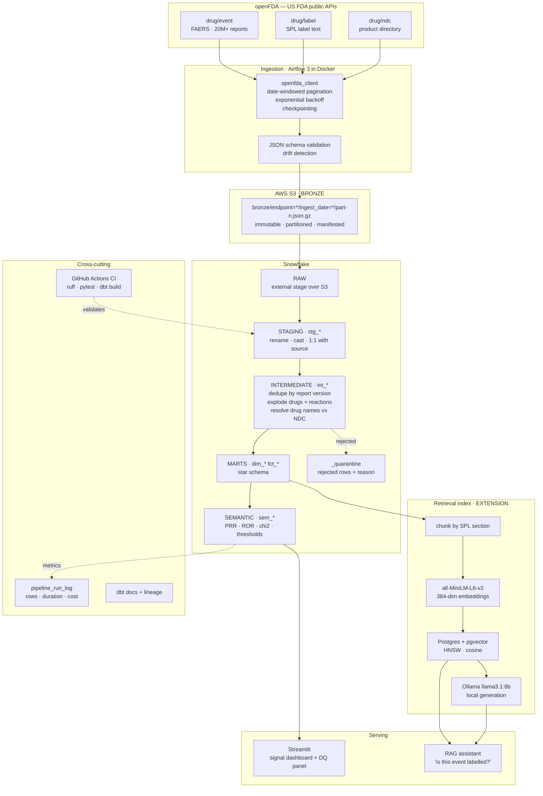
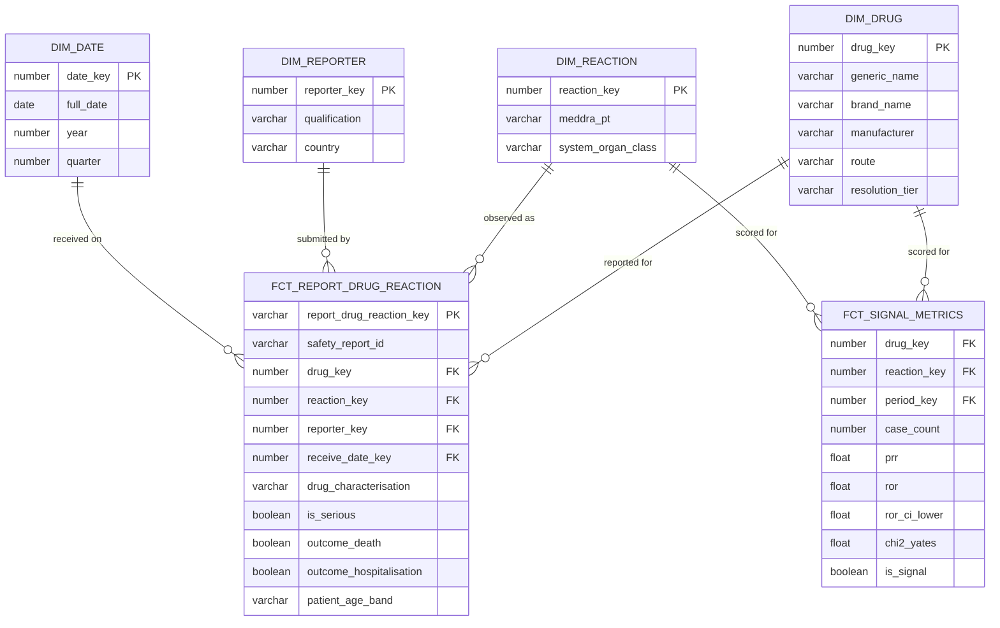
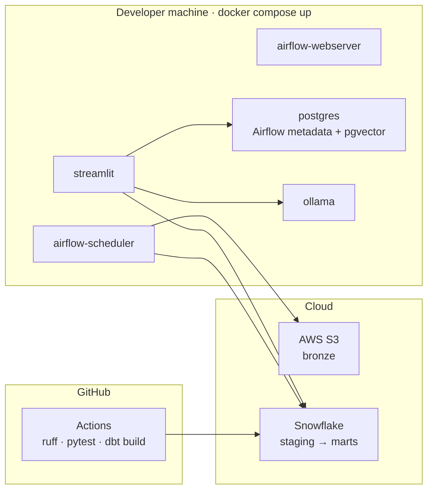

# Architecture

## Pharmacovigilance Signal Detection & Label Intelligence Platform

| | |
|---|---|
| **Author** | Nastaran Kouhdareh |
| **Version** | 0.1 — draft for instructor review |
| **Date** | 3 August 2026 |
| **Depends on** | `business_requirements.md`, `technical_requirements.md` |
| **Status** | ⬜ Awaiting Instructor / TA approval (Gate 3 of 3) |

---

## 1. End-to-end architecture

---

## 2. Layer-by-layer rationale

### 2.1 Ingestion

Python with `requests` — no ingestion framework. At three endpoints and one
authentication scheme, a framework would add a dependency without removing work.

The design is shaped by one hard constraint: openFDA caps the `skip` offset at
26,000 records. Any query matching more than that cannot be paged to the end.
The solution is to **partition every query by `receivedate` window** rather than
paging a single large result set.

This constraint turns out to be a gift. Date-windowed extraction is naturally:

- **idempotent** — re-running a window yields the same rows
- **resumable** — a checkpoint records the last completed window
- **backfillable** — historical reprocessing is the same code with different parameters

Historical loading uses the quarterly bulk files instead of the API, because
pulling millions of records through a rate-limited endpoint would waste hours.
Two ingestion paths, one shared writer.

### 2.2 Bronze — S3

Raw payloads are written unmodified, gzipped, partitioned by endpoint and ingest
date, and never mutated. Every file has a manifest recording the query window,
record count and run id.

The reason for keeping bronze immutable is that **transformation logic will be
wrong at least once**. When drug-name resolution is improved on 12 August, silver
and gold can be rebuilt from bronze without re-hitting the API.

### 2.3 Silver — cleaning and conforming

Three operations, in order:

1. **Deduplicate.** FAERS resubmits amended cases. Keep the row with the highest
   `safetyreportversion` per `safetyreportid`. Count and publish what was removed.
2. **Explode.** One report contains many drugs and many reactions. Flatten to the
   atomic grain: one row per (case, drug, reaction), preserving whether each drug
   was *suspect* or *concomitant* — a distinction that materially changes the
   metrics downstream.
3. **Resolve drug identity.** Free-text names are normalised and matched against
   the NDC directory in tiers, with unresolved names retained under a Unknown key
   and the resolution rate published.

Rows failing validation go to `_quarantine` with a reason, not to `/dev/null`.
Silently dropping bad records is how pipelines lie.

### 2.4 Gold — dimensional model

**Why a star schema rather than one big table:** the access pattern is filter-heavy
and low-cardinality on every axis — drug, reaction, seriousness, reporter country,
period. Conformed dimensions also mean the signal mart and the atomic fact agree on
what a drug *is*, which is precisely the problem the raw data does not solve.

**Why two fact tables:** they have genuinely different grains. The atomic fact
answers "show me the cases", the signal mart answers "show me the signals". Deriving
the second from the first at query time would recompute a 2×2 contingency table
across tens of millions of rows on every dashboard load.

**Physical design:** `fct_report_drug_reaction` is clustered on `receive_date_key`,
since nearly every query is time-bounded. `fct_signal_metrics` is pre-aggregated
precisely so the dashboard never computes statistics interactively.

### 2.5 Semantic layer

PRR, ROR, the confidence interval and the signal threshold are defined in exactly
one dbt model, `sem_signal_metrics`. Thresholds are dbt variables, not literals.

This exists to prevent the most common analytics failure: two consumers reporting
different numbers for the same question because each reimplemented the formula.

### 2.6 Serving

Streamlit, with two panels: signals (ranked, filterable) and data quality
(resolution rate, duplicate rate, rejection rate, cost per run).

Surfacing data quality *in the product* rather than hiding it in logs is a
deliberate choice. An analyst who cannot see that 30% of drug names are unresolved
will over-trust the signal ranking.

### 2.7 Retrieval extension

Chunking is by SPL section — indications, warnings, contraindications, adverse
reactions. No sliding window, no chunk-size tuning, no framework. A label section
*is* the natural retrieval unit, so the simplest approach is also the correct one.

Retrieval is **metadata-filtered, then semantic**: SQL narrows to the relevant drug
and section type, and similarity ranking runs only within that candidate set. This
is why pgvector was chosen over a dedicated vector database — the filter and the
ranking are one query against one engine.

Generation runs locally via Ollama. No data leaves the environment, cost is zero,
and the provider is swappable behind one interface.

If similarity does not clear a threshold, the system answers "outside indexed
scope" and never invokes the generator. That guardrail has a test.

---

## 3. Deployment view

**Hybrid, deliberately.** Orchestration and compute are local because they are free
and reproducible; storage and warehouse are cloud because that is where the
industry-relevant skills are, and the credits exist. One Postgres container serves
both Airflow metadata and the vector store — fewer moving parts to explain and to
fail. See ADR-009.

---

## 4. Failure modes and responses

| Failure | Detection | Response |
|---|---|---|
| openFDA returns 429 | HTTP status | Exponential backoff, 5 attempts, then fail task |
| openFDA returns 5xx | HTTP status | Same |
| Source schema changes | JSON schema validation | Log drift, quarantine affected rows, continue |
| Malformed record | Parse exception | Route to `_quarantine` with reason |
| Duplicate cases | `safetyreportversion` comparison | Retain latest, count removals |
| Partial ingestion run | Checkpoint table | Resume from last completed date window |
| dbt test failure | dbt exit code | Fail DAG; marts remain at previous state |
| Drug unresolvable | No NDC match | Assign `drug_key = -1`, count, publish rate |
| Retrieval finds nothing relevant | Similarity below threshold | Return "outside scope"; do not generate |
| Snowflake trial expires | Connection failure | Documented Postgres fallback (ADR-002) |
| Unexpected cloud spend | AWS Budget alert at €5 | Email alert; halt cloud tasks |

---

## 5. Key decisions and trade-offs

| Decision | Chosen | Rejected | Trade-off accepted |
|---|---|---|---|
| Domain and source | openFDA FAERS | MIMIC-IV; German G-BA data | Lost real clinical records; gained zero access gate and full publishability |
| Pipeline pattern | Batch (medallion) | Lambda / Kappa | No real-time source exists for this data; a synthetic stream would add risk without value (ADR-007) |
| Warehouse | Snowflake | DuckDB, Postgres | Trial expiry risk, accepted because cost is ~$2 and it matches the reference architecture |
| Transformation | dbt | Spark | No distributed workload at this volume (ADR-004) |
| Drug resolution | Tiered exact matching | Fuzzy / trigram matching | Lower resolution rate, accepted in exchange for a bounded two-day effort and a *measured* result (ADR-005) |
| Serving model | Star schema + pre-aggregated signal mart | One big table | More models to maintain; far better query performance and metric consistency |
| Vector store | pgvector | Elasticsearch, Qdrant | Lower ceiling at scale; one engine, one query, no extra service (ADR-006) |
| Generation | Local Ollama | Hosted API | Slower inference; zero cost, zero data egress, no key management (ADR-008) |
| Deployment | Hybrid local + cloud | Fully cloud | Not production-shaped; finishable in three weeks and free to re-run (ADR-009) |

---

## 6. What this architecture deliberately does not do

Naming these explicitly, because unstated omissions read as oversights while
stated ones read as decisions:

- **No streaming.** FAERS has no real-time feed. ADR-007.
- **No fuzzy drug matching.** Unbounded effort on the riskiest component. ADR-005.
- **No causality inference.** Disproportionality identifies statistical signals for
  human review. This is a domain constraint, not a technical one.
- **No Kubernetes.** Compose is sufficient for one developer and one machine.
- **No orchestrated ML.** Out of scope per business requirements §7.

---

## 7. ADR index

| ADR | Decision |
|---|---|
| ADR-001 | Domain and data source selection |
| ADR-002 | Snowflake as warehouse, with Postgres fallback |
| ADR-003 | Medallion layering over Data Vault |
| ADR-004 | dbt rather than Spark for transformation |
| ADR-005 | Tiered exact matching for drug resolution; fuzzy matching rejected |
| ADR-006 | pgvector rather than Elasticsearch or Qdrant |
| ADR-007 | No streaming layer |
| ADR-008 | Local LLM rather than hosted API |
| ADR-009 | Hybrid local/cloud deployment |

---

## 8. Approval

### Questions for architecture review

1. Is the two-fact-table design justified, or would you prefer the signal metrics
   computed as a view over the atomic fact?
2. Is a hybrid deployment acceptable, or is a fully cloud implementation expected
   for the grade?
3. Does sharing one Postgres container between Airflow metadata and the vector
   store constitute unacceptable coupling?
4. Is the bronze layer in S3 with Snowflake external stages the right split, or
   should raw data land directly in Snowflake?

| Gate | Approver | Date | Status |
|---|---|---|---|
| Business requirements | | | ⬜ |
| Technical requirements | | | ⬜ |
| Architecture *(this document)* | | | ⬜ |
